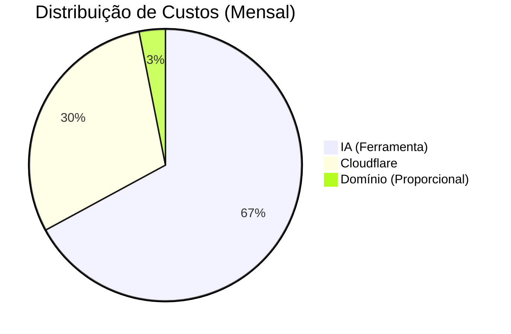
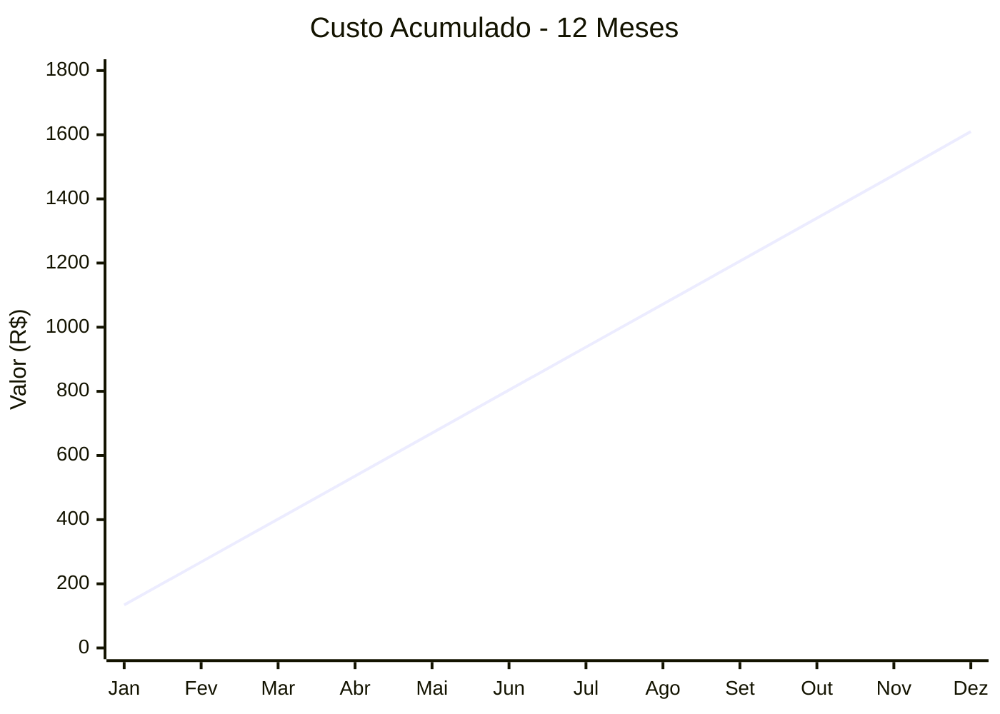

# 📊 Relatório Financeiro & Controle de Gastos
**GetNexo** | Base: 2 Sócios

## 💰 Resumo Financeiro

| Categoria | Custo Mensal Total | Custo Anual Total |
|-----------|--------------------|-------------------|
| **Infraestrutura** | R$ 44,17 | R$ 530,00 |
| **Inteligência Artificial** | R$ 90,00 | R$ 1.080,00 |
| **TOTAL** | **R$ 134,17** | **R$ 1.610,00** |

---

## 👥 Divisão por Sócio (50/50)

Cada sócio deve contribuir mensalmente com:

> **R$ 67,09 / mês**

| Sócio | Contribuição Mensal | Status |
|-------|---------------------|--------|
| **Leandro Barbosa** | R$ 67,09 | 🟡 Pendente |
| **Sócio 2** | R$ 67,09 | 🟡 Pendente |

---

## 📉 Gráficos de Distribuição

### Composição dos Gastos Mensais

### Projeção Acumulada (1 Ano)

---

## 📝 Detalhamento dos Itens

| Item | Valor | Frequência | Detalhes | Ação Necessária |
|------|-------|------------|----------|-----------------|
| **Domínio (getnexo.com.br)** | R$ 50,00 | **Anual** | Renovação anual. Custo diluído: R$ 4,17/mês. | ✅ Pago |
| **Cloudflare** | R$ 40,00 | **Mensal** | Plano Pro/Standard ou Add-ons. | 📅 Vence dia 05 |
| **IA (Assinatura)** | R$ 90,00 | **Mensal** | Ferramenta de IA (ex: ChatGPT/Midjourney). | 📅 Vence dia 10 |

> [!TIP]
> **Dica de Economia:** Considere planos anuais para a IA ou Cloudflare se houver desconto acima de 20%.
