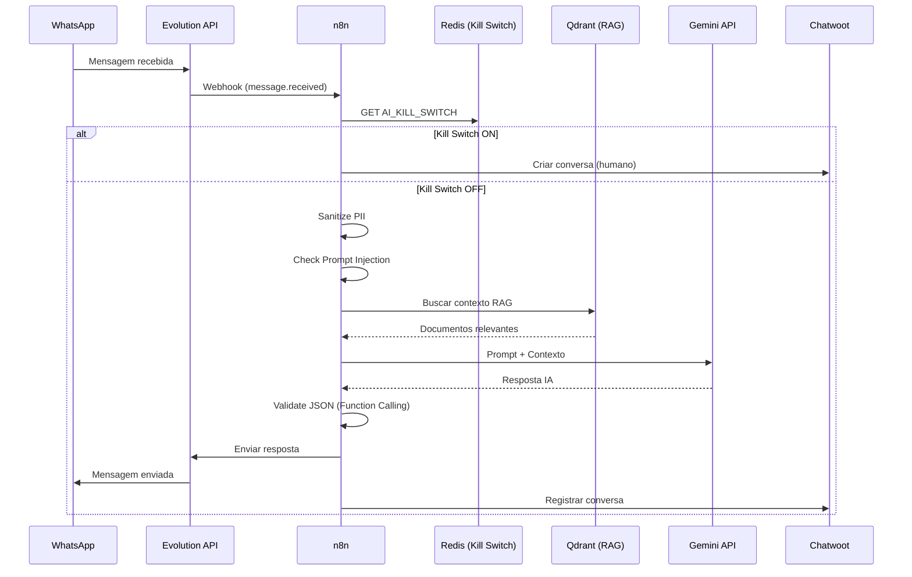
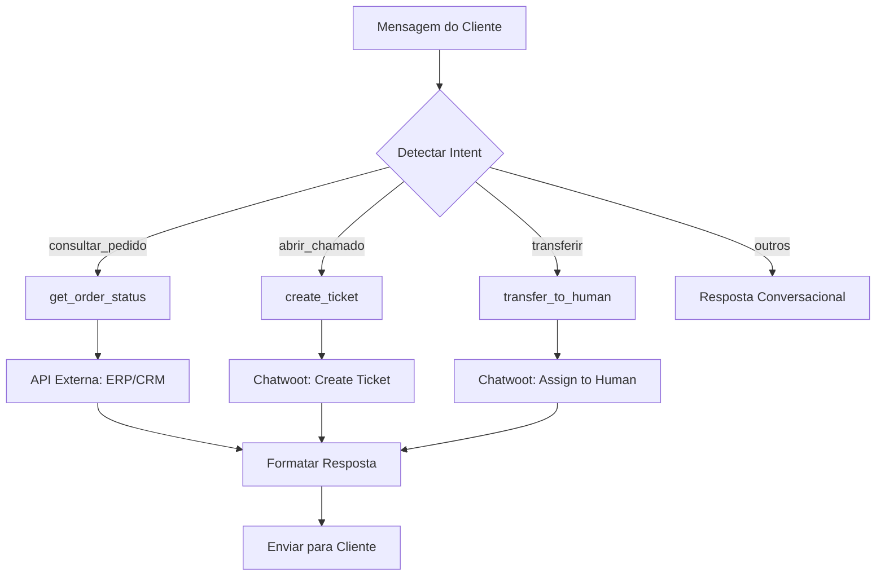
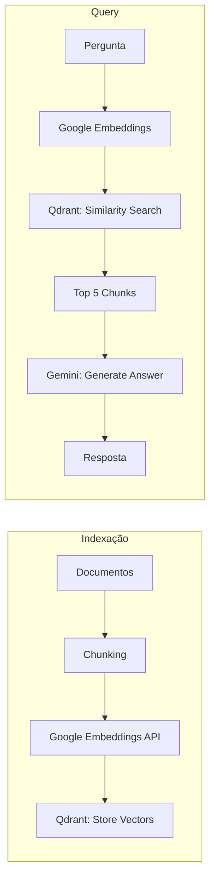

# 🏗️ Arquitetura do Sistema

**Status de Conclusão**: `[░░░░░░░░░░] 0%`

## 1. Diagrama de Rede

```
┌─────────────────────────────────────────────────────────────────────────────┐
│                              INTERNET                                        │
│                    Cloudflare Edge (CDN, WAF, DDoS)                         │
└─────────────────────────────────┬───────────────────────────────────────────┘
                                  │
                                  │ HTTPS (443)
                                  │
┌─────────────────────────────────▼───────────────────────────────────────────┐
│                         CLOUDFLARE TUNNEL                                    │
│                          (cloudflared)                                       │
│                        Conexão outbound-only                                 │
│                        Nenhuma porta exposta                                 │
└─────────────────────────────────┬───────────────────────────────────────────┘
                                  │
┌─────────────────────────────────▼───────────────────────────────────────────┐
│                        FRONTEND NETWORK                                      │
│  ┌────────────────────┐       ┌──────────────────────────────────────────┐  │
│  │      CrowdSec      │◀──────│              Traefik v3                  │  │
│  │   (IPS Analysis)   │ logs  │   • Rate Limiting (100 req/min)          │  │
│  │   • Threat Intel   │       │   • Security Headers                     │  │
│  │   • IP Banning     │       │   • Brotli Compression                   │  │
│  └────────────────────┘       │   • CrowdSec Bouncer Plugin              │  │
│                               └─────────────────┬────────────────────────┘  │
└─────────────────────────────────────────────────┼────────────────────────────┘
                                                  │
┌─────────────────────────────────────────────────▼────────────────────────────┐
│                          BACKEND NETWORK                                      │
│                                                                               │
│  ┌─────────────────┐  ┌─────────────────┐  ┌─────────────────────────────┐  │
│  │    Chatwoot     │  │      n8n        │  │      Evolution API          │  │
│  │   (Main App)    │  │  (Orchestrator) │  │       (WhatsApp)            │  │
│  │   Port: 3000    │  │   Port: 5678    │  │       Port: 8080            │  │
│  │   RAM: 1GB      │  │   RAM: 768MB    │  │       RAM: 256MB            │  │
│  └────────┬────────┘  └────────┬────────┘  └─────────────────────────────┘  │
│           │                    │                                              │
│  ┌────────▼────────┐  ┌────────▼────────┐  ┌─────────────────────────────┐  │
│  │ Chatwoot Worker │  │   Browserless   │  │      Stirling-PDF           │  │
│  │    (Sidekiq)    │  │ (Headless Chrome│  │    (Doc Generation)         │  │
│  │   RAM: 512MB    │  │   RAM: 512MB    │  │       RAM: 256MB            │  │
│  └─────────────────┘  └─────────────────┘  └─────────────────────────────┘  │
│                                                                               │
└───────────────────────────────────┬───────────────────────────────────────────┘
                                    │
┌───────────────────────────────────▼───────────────────────────────────────────┐
│                       DATABASE NETWORK (Isolated)                             │
│                       Sem acesso externo direto                               │
│                                                                               │
│  ┌─────────────────┐  ┌─────────────────┐  ┌─────────────┐  ┌─────────────┐  │
│  │   PostgreSQL    │◀─│    PgBouncer    │  │    Redis    │  │   Qdrant    │  │
│  │   (Database)    │  │   (Pooling)     │  │   (Cache)   │  │ (VectorDB)  │  │
│  │   Port: 5432    │  │   Port: 6432    │  │  Port: 6379 │  │  Port: 6333 │  │
│  │   RAM: 512MB    │  │   RAM: 64MB     │  │  RAM: 128MB │  │  RAM: 256MB │  │
│  │                 │  │                 │  │             │  │             │  │
│  │ • chatwoot_prod │  │ • max_conn: 200 │  │ • 100MB max │  │ • on_disk   │  │
│  │ • n8n_db        │  │ • pool_size: 10 │  │ • LRU evict │  │ • mmap      │  │
│  │ • metabase      │  │ • transaction   │  │ • kill_sw   │  │ • API auth  │  │
│  └─────────────────┘  └─────────────────┘  └─────────────┘  └─────────────┘  │
│                                                                               │
└───────────────────────────────────────────────────────────────────────────────┘
```

## 2. Fluxo de Requisição

```
Cliente → Cloudflare Edge → Tunnel → Traefik → CrowdSec Check → Service → Database
           (WAF+CDN)      (Zero Trust)  (Rate Limit)  (IPS)     (App)    (Pooled)
```

## 3. Distribuição de RAM

```
Total Sistema: 8GB
├── Sistema Operacional: ~1GB
├── Docker Engine: ~400MB
└── Containers: ~4.6GB
    ├── PostgreSQL: 512MB
    ├── PgBouncer: 64MB
    ├── Redis: 128MB
    ├── Qdrant: 256MB
    ├── Chatwoot: 1024MB
    ├── Chatwoot Worker: 512MB
    ├── n8n: 768MB
    ├── Evolution API: 256MB
    ├── Stirling-PDF: 256MB
    ├── Browserless: 512MB
    ├── Traefik: 128MB
    ├── CrowdSec: 128MB
    ├── Cloudflared: 64MB
    └── Watchtower: 64MB

Margem para burst: ~2GB
```

## 4. Fluxos de Dados

### 4.1 Mensagem WhatsApp → Resposta IA



### 4.2 Function Calling



### 4.3 RAG (Retrieval-Augmented Generation)


