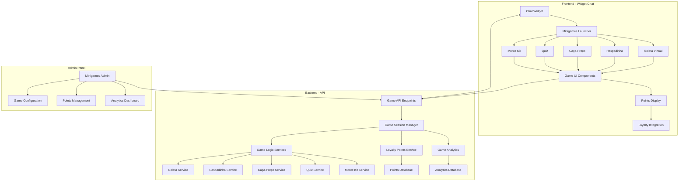
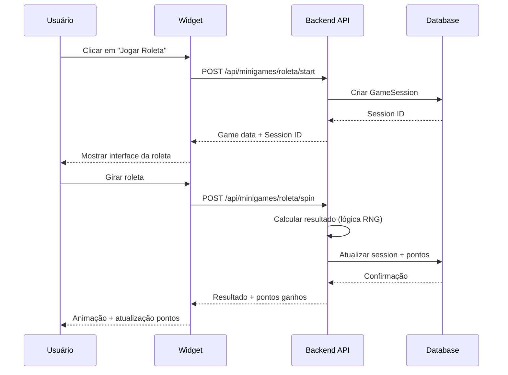

# Arquitetura do Sistema de Minigames no Chat

## Visão Geral
O sistema de minigames será integrado no widget de chat GetNexo, permitindo jogos interativos como roleta virtual, raspadinha, caça-preço, quiz e monte kit. Cada jogo concede pontos de fidelidade e prêmios, com analytics completos de engajamento.

## Arquitetura dos Componentes

## Modelos de Dados

### GameSession
- id: String
- userId: String
- gameType: 'roleta' | 'raspadinha' | 'caca_preco' | 'quiz' | 'monte_kit'
- status: 'active' | 'completed' | 'abandoned'
- score: Number
- pointsEarned: Number
- rewards: Array
- startedAt: Date
- completedAt: Date

### LoyaltyPoints
- userId: String
- totalPoints: Number
- availablePoints: Number
- transactions: Array
- level: Number
- badges: Array

### GameAnalytics
- gameType: String
- totalSessions: Number
- completionRate: Number
- avgSessionTime: Number
- pointsDistributed: Number
- conversionToPurchase: Number

## Fluxo de Jogo

## Integração com Fidelidade

- Cada jogo concede pontos baseados no desempenho
- Pontos podem ser trocados por descontos/recompensas
- Sistema de níveis de fidelidade
- Analytics de retenção por pontos

## Configuração Admin

- Ativar/desativar jogos individualmente
- Configurar probabilidades e prêmios
- Gerenciar catálogo de recompensas
- Dashboard de analytics em tempo real
- Configuração de campanhas sazonais