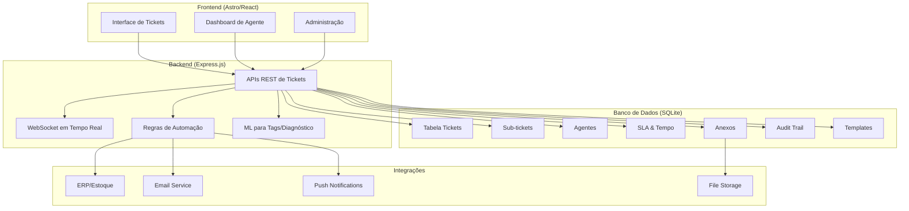
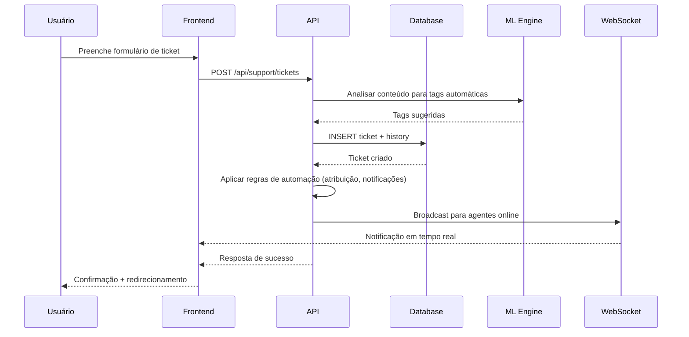
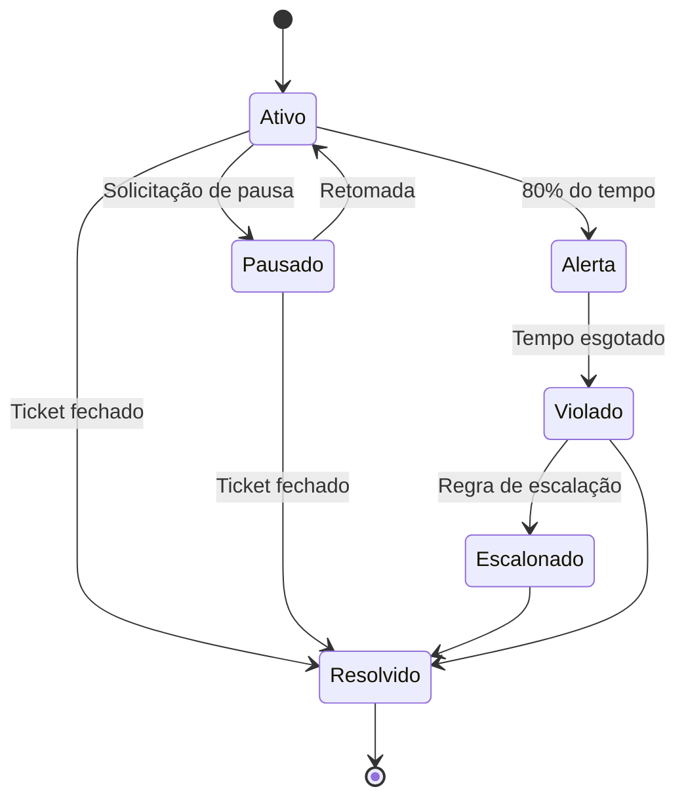

# Arquitetura Completa do Sistema de Tickets GetNexo

## Visão Geral

O sistema de tickets será implementado como uma extensão completa do sistema existente, integrando com o chat-api e getnexo-site. Serão implementadas 50 funcionalidades avançadas de helpdesk/suporte técnico.

## Arquitetura Geral



## Especificações Técnicas Detalhadas

### 1. Pastas Agente
**Estrutura de Dados:**
```sql
CREATE TABLE agent_folders (
    id INTEGER PRIMARY KEY AUTOINCREMENT,
    agent_id INTEGER NOT NULL,
    name TEXT NOT NULL,
    parent_id INTEGER,
    color TEXT,
    icon TEXT,
    created_at TIMESTAMP DEFAULT CURRENT_TIMESTAMP,
    FOREIGN KEY (agent_id) REFERENCES users(id),
    FOREIGN KEY (parent_id) REFERENCES agent_folders(id)
);

CREATE TABLE ticket_folder_assignments (
    ticket_id TEXT PRIMARY KEY,
    folder_id INTEGER NOT NULL,
    assigned_at TIMESTAMP DEFAULT CURRENT_TIMESTAMP,
    FOREIGN KEY (ticket_id) REFERENCES tickets(id),
    FOREIGN KEY (folder_id) REFERENCES agent_folders(id)
);
```
**APIs:** `GET /api/support/folders`, `POST /api/support/folders`, `PUT /api/support/tickets/:id/folder`
**Fluxo:** Agentes organizam tickets em pastas hierárquicas com drag-and-drop.

### 2. Sub-tickets
**Estrutura:** Campo `parent_id` na tabela tickets para relacionamentos pai-filho.
**APIs:** `POST /api/support/tickets/:parentId/subtickets`, `GET /api/support/tickets/:id/tree`
**Frontend:** Componente de árvore com dependências visuais e progresso agregado.

### 3. Vinculação Pendências
```sql
CREATE TABLE ticket_checklist_items (
    id INTEGER PRIMARY KEY AUTOINCREMENT,
    ticket_id TEXT NOT NULL,
    title TEXT NOT NULL,
    description TEXT,
    status TEXT DEFAULT 'pending', -- pending, in_progress, completed
    assigned_to INTEGER,
    due_date TIMESTAMP,
    created_at TIMESTAMP DEFAULT CURRENT_TIMESTAMP,
    FOREIGN KEY (ticket_id) REFERENCES tickets(id),
    FOREIGN KEY (assigned_to) REFERENCES users(id)
);
```
**APIs:** CRUD completo para itens de checklist com progresso em tempo real.

### 4. Transferência Histórico
**Implementação:** `PUT /api/support/tickets/:id/transfer` com log automático em `ticket_history`.
**Notificações:** WebSocket para agentes envolvidos, email de confirmação.

### 5. Pause SLA
**Campos:** `sla_paused BOOLEAN`, `sla_pause_reason TEXT`, `sla_pause_duration INTEGER`.
**API:** `PUT /api/support/tickets/:id/sla/pause` com validação de permissões.
**Cálculo:** SLA total = tempo ativo + tempo pausado (não conta para deadline).

### 6. Merge/Duplicar
**Merge:** Transferir comentários, anexos e histórico para ticket alvo.
**Duplicate:** Criar cópia exata com novo ID, mantendo relacionamentos.
**API:** `POST /api/support/tickets/:id/merge/:targetId`

### 7. Tags Automáticas
**Integração:** Usa ML engine existente para análise de texto.
**Regras:** Classificação baseada em título + descrição + histórico de resolução.
**Treinamento:** Dataset supervisionado de tickets categorizados.

### 8. Prioridade Visual
**CSS Classes:** `.priority-urgent`, `.priority-high`, `.priority-medium`, `.priority-low`
**Indicadores:** Cores, ícones, badges com animações.
**Ordenação:** Filtros e listas respeitam hierarquia de prioridade.

### 9. Filtros Avançados
**Campos:** status, priority, agent_id, created_at, tags, category, full_text_search.
**Saved Filters:** `CREATE TABLE saved_filters (id, user_id, name, filters JSON)`.
**API:** `GET /api/support/tickets?filters=encoded_json`

### 10. Histórico Global
**Timeline:** Combina ticket_history + comments + status_changes.
**Diffs Visuais:** Highlight de mudanças em campos.
**Export:** PDF/CSV do histórico completo.

### 11. Lembretes
```sql
CREATE TABLE ticket_reminders (
    id INTEGER PRIMARY KEY AUTOINCREMENT,
    ticket_id TEXT NOT NULL,
    title TEXT NOT NULL,
    description TEXT,
    reminder_date TIMESTAMP NOT NULL,
    is_recurring BOOLEAN DEFAULT 0,
    recurrence_pattern TEXT, -- daily, weekly, custom
    is_completed BOOLEAN DEFAULT 0,
    created_at TIMESTAMP DEFAULT CURRENT_TIMESTAMP,
    FOREIGN KEY (ticket_id) REFERENCES tickets(id)
);
```
**Notificações:** Push + Email + Dashboard alerts.

### 12. Templates
```sql
CREATE TABLE ticket_templates (
    id INTEGER PRIMARY KEY AUTOINCREMENT,
    name TEXT NOT NULL,
    category TEXT,
    title_template TEXT,
    description_template TEXT,
    priority TEXT DEFAULT 'medium',
    tags TEXT, -- JSON array
    checklist_items TEXT, -- JSON array
    is_public BOOLEAN DEFAULT 0,
    created_by INTEGER,
    created_at TIMESTAMP DEFAULT CURRENT_TIMESTAMP,
    FOREIGN KEY (created_by) REFERENCES users(id)
);
```
**API:** `GET /api/support/templates`, `POST /api/support/tickets/from-template/:templateId`

### 13. Diagnósticos
**Ferramentas:** Network diagnostics, system logs, performance metrics.
**API:** `POST /api/support/tickets/:id/run-diagnostic`
**Auto-attach:** Resultados anexados automaticamente ao ticket.

### 14. Anexos
**Storage:** Local filesystem com backup cloud.
**Tipos Suportados:** Images, PDFs, logs, configs, videos.
**Preview:** Thumbnails e viewers inline.
**Assinatura Digital:** Hash SHA-256 para verificação de integridade.

### 15. Assinatura Digital
**Implementação:** Geração de hash dos arquivos enviados.
**Verificação:** Endpoint para validar assinatura contra arquivo atual.
**Compliance:** Certificado digital para LGPD e outras regulamentações.

### 16. App Version
```sql
CREATE TABLE app_versions (
    id INTEGER PRIMARY KEY AUTOINCREMENT,
    version TEXT NOT NULL,
    changes TEXT,
    is_required BOOLEAN DEFAULT 0,
    target_platforms TEXT, -- web, mobile, desktop
    release_date TIMESTAMP,
    created_at TIMESTAMP DEFAULT CURRENT_TIMESTAMP
);
```
**API:** `GET /api/app/version` - força update se versão incompatível.

### 17. Cronômetro Custo
**Tracking:** Timer start/stop em frontend, sync com backend.
**Cálculo:** `total_cost = hours_worked * hourly_rate`
**Rate:** Configurável por agente/categoria/projeto.

### 18. Peçaria Estoque
**Integração ERP:** API para reservar/liberar/consumir itens.
**Workflow:** Solicitação → Aprovação → Entrega → Consumo.
**Tracking:** Histórico completo de uso de peças por ticket.

### 19. Audit Trail
**Middleware:** Intercepta todas as operações CRUD.
**Log:** user_id, action, table, record_id, old_values, new_values, timestamp.
**Compliance:** Imutável, exportável para auditorias.

### 20. Feedback RH
```sql
CREATE TABLE agent_feedback (
    id INTEGER PRIMARY KEY AUTOINCREMENT,
    agent_id INTEGER NOT NULL,
    ticket_id TEXT,
    evaluator_id INTEGER NOT NULL,
    rating INTEGER, -- 1-5
    comments TEXT,
    categories TEXT, -- JSON: {response_time: 4, resolution: 5, communication: 3}
    created_at TIMESTAMP DEFAULT CURRENT_TIMESTAMP,
    FOREIGN KEY (agent_id) REFERENCES users(id),
    FOREIGN KEY (evaluator_id) REFERENCES users(id)
);
```
**Métricas:** Média de ratings, tempo resposta, taxa resolução.

### 21. Automação
**Regras:** Condicionais if/then/else baseadas em eventos.
**Triggers:** ticket_created, status_changed, sla_violation, time_based.
**Ações:** assign_agent, send_notification, escalate, close_ticket.

### 22. Modo Treinamento
**Sandbox:** Database separado para dados fictícios.
**Features:** Mesmo interface, tickets de exemplo, métricas simuladas.
**Avaliação:** Performance tracking para capacitação.

## Componentes Frontend Principais

### TicketList Component
```jsx
function TicketList({ filters, onTicketSelect }) {
    const [tickets, setTickets] = useState([]);
    const [loading, setLoading] = useState(true);
    const [wsConnection, setWsConnection] = useState(null);

    useEffect(() => {
        loadTickets();
        setupWebSocket();
    }, [filters]);

    const setupWebSocket = () => {
        const ws = new WebSocket(`${WS_URL}/tickets`);
        ws.onmessage = (event) => {
            const update = JSON.parse(event.data);
            updateTicketInList(update);
        };
        setWsConnection(ws);
    };

    return (
        <div className="ticket-list">
            <AdvancedFilters onFilterChange={setFilters} />
            <div className="tickets-grid">
                {tickets.map(ticket => (
                    <TicketCard
                        key={ticket.id}
                        ticket={ticket}
                        onSelect={onTicketSelect}
                        showPriority={true}
                        showSLA={true}
                    />
                ))}
            </div>
        </div>
    );
}
```

### TicketDetail Component
```jsx
function TicketDetail({ ticketId }) {
    const [ticket, setTicket] = useState(null);
    const [history, setHistory] = useState([]);
    const [attachments, setAttachments] = useState([]);
    const [timeTracker, setTimeTracker] = useState({ running: false, seconds: 0 });

    return (
        <div className="ticket-detail">
            <TicketHeader ticket={ticket} />
            <SLAAndicator ticket={ticket} />
            <TimeTracker 
                ticketId={ticketId} 
                tracker={timeTracker} 
                onUpdate={setTimeTracker} 
            />
            <ChecklistManager ticketId={ticketId} />
            <AttachmentManager 
                ticketId={ticketId} 
                attachments={attachments} 
                onUpload={handleUpload}
            />
            <CommentSection ticketId={ticketId} />
            <HistoryTimeline history={history} />
        </div>
    );
}
```

## Fluxos de Usuário Detalhados

### Fluxo de Criação de Ticket


### Sistema de SLA com Pause


## Considerações de Performance e Segurança

### Performance
- **Índices:** Em campos de busca crítica (status, agent_id, created_at, tags)
- **Cache:** Redis para queries frequentes de tickets e agentes
- **Paginação:** Cursor-based para listas grandes
- **Lazy Loading:** Anexos e histórico carregados sob demanda

### Segurança
- **Validação:** Input sanitization em todas as APIs
- **Rate Limiting:** Por usuário e endpoint
- **Audit:** Middleware de logging imutável
- **Encryption:** Dados sensíveis criptografados

### Escalabilidade
- **WebSocket:** Para updates em tempo real
- **Queue:** Background jobs para automações pesadas
- **CDN:** Para anexos estáticos
- **Database:** Sharding por cliente se necessário

### Monitoramento
- **Métricas:** Prometheus para KPIs de sistema
- **Alertas:** SLA violations, queue depth, error rates
- **Logging:** Estruturado com níveis (INFO, WARN, ERROR)
- **Health Checks:** Endpoints para monitoring

Este plano fornece arquitetura completa e especificações detalhadas para implementar todas as 50 funcionalidades solicitadas no sistema de tickets GetNexo, mantendo integração com a arquitetura existente e seguindo melhores práticas de desenvolvimento.