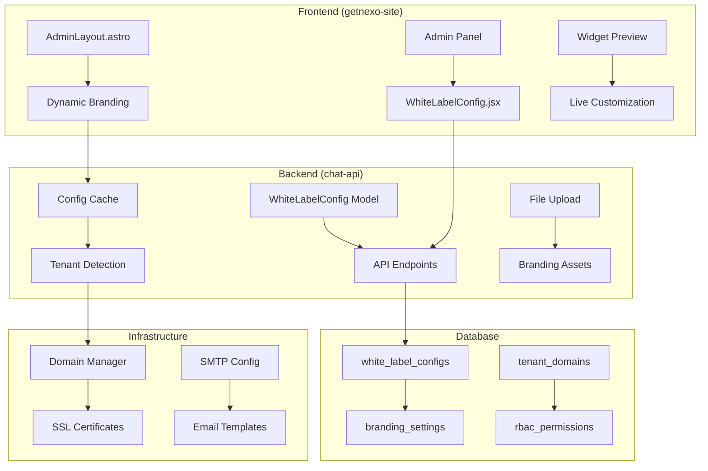

# Plano de Integração White-Label para GetNexo

## Análise da Estrutura Atual

### Componentes Principais
- **chat-api**: Backend Node.js com SQLite, APIs REST, sistema de tickets avançado
- **getnexo-site**: Frontend Astro + React, painel admin, dashboards analytics

### Pontos de Integração Existentes
1. **Branding**: Pasta `custom/` com CSS, JS e logos para personalização
2. **Widget Chat**: Endpoint `/widget.js` no backend para embedding
3. **RBAC**: Sistema de roles no banco (Admin, Reseller, User) com permissões
4. **Infraestrutura**: Configs básicas, mas sem domínio/SSL/SMTP específicos

### Arquivos-Chave Examinados
- `DashboardConfig.jsx`: Configuração de dashboards analytics
- `server.js`: APIs REST, sistema de config com cache
- `AdminLayout.astro`: Layout admin com branding básico
- Modelos Mongoose para tickets e entidades relacionadas

## Plano Detalhado de Integração

### 1. Novos Modelos de Dados
**Localização**: `chat-api/models/WhiteLabelConfig.js`
- Schema com campos para branding, cores, logos
- Configurações de domínio, SSL, SMTP
- Permissões RBAC específicas
- Configurações do widget chat

### 2. Expansão do Painel Admin
**Componente**: Expandir `DashboardConfig.jsx` ou criar novo `WhiteLabelConfig.jsx`
- Seções para branding (logo, cores, CSS custom)
- Configurações de infraestrutura (domínio, certificados, SMTP)
- RBAC e permissões
- Preview do widget customizado

### 3. APIs REST para White-Label
**Endpoints**:
- `GET/POST/PUT/DELETE /api/config/whitelabel`
- `POST /api/whitelabel/branding/upload` (para logos/imagens)
- `GET /api/whitelabel/widget/:tenant` (widget customizado)
- `POST /api/whitelabel/infrastructure/validate` (validação domínio/SSL)

### 4. Conexão Frontend-Backend
- Middleware para detectar tenant por domínio/subdomínio
- Cache de configurações por tenant
- Sincronização em tempo real das mudanças

### 5. Integração com Componentes Existentes
- Modificar `AdminLayout.astro` para usar branding dinâmico
- Atualizar `/widget.js` para aceitar parâmetros de tenant
- Expandir sistema de roles com permissões white-label

## Arquitetura Proposta

## Próximos Passos de Implementação
1. Criar modelo WhiteLabelConfig
2. Implementar APIs REST
3. Expandir painel admin
4. Integrar branding dinâmico
5. Configurar infraestrutura
6. Testar integração completa